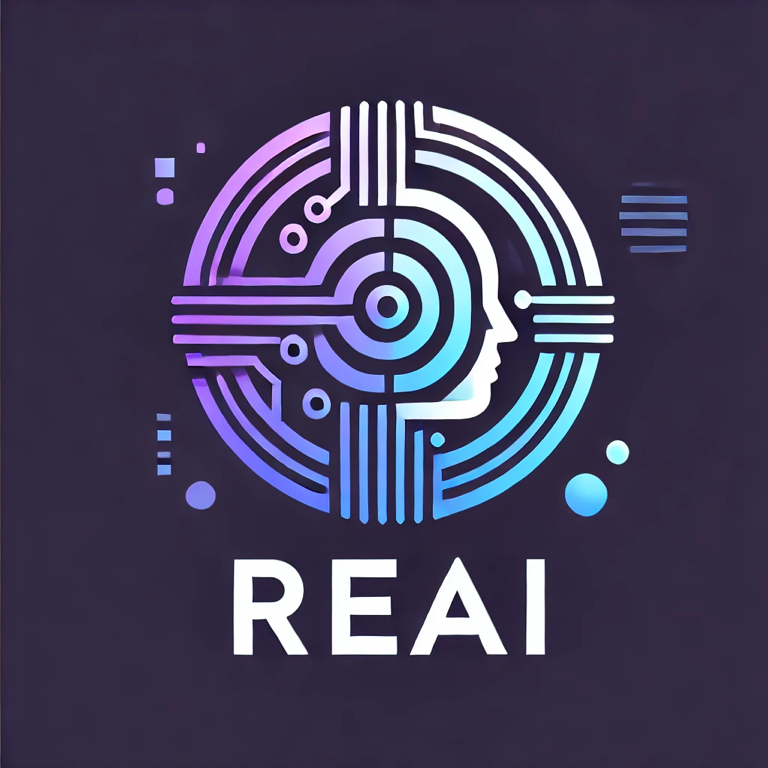

# ReAI: Automated Legacy Code Refactoring Using AI Agents

ReAI is a system powered by AI to refactor legacy code automatically. The project takes in a zip file containing legacy code (e.g., COBOL) and converts it to modern programming languages such as Python, following best practices, design patterns, and technical requirements specified by the user. In addition to refactoring, ReAI generates automated tests, comprehensive documentation, and test documentation.

## Table of Contents

1. Project Overview
2. Features
3. Technologies Used
4. Getting Started
5. Usage
6. API Documentation
7. Project Structure
8. GUI Usage
9. License

---

## Project Overview

ReAI is built using a microservice architecture. The project is split into two main components:

1. **Backend**: A FastAPI-based service where users can upload a ZIP file containing legacy code and specify technical requirements for the refactoring process.
2. **AI Agent**: Using LangGraph (Agent LLM), ReAI intelligently refactors the code and generates the necessary tests and documentation.

### Backend Workflow
1. User uploads a ZIP file containing legacy code.
2. The backend processes the file, unzips it, and reads the code.
3. The AI Agent transforms the legacy code into the target programming language using best practices and specified requirements.
4. The agent generates automated tests, code documentation, and even architecture diagrams.
5. The backend streams updates to the client as the code transformation happens.

---

## Features

- **Automated Code Refactoring**: Converts legacy code (e.g., COBOL) into modern programming languages like Python.
- **Design Pattern Application**: Allows users to specify design patterns (e.g., Repository Pattern) during refactoring.
- **Framework Support**: Supports frameworks like FastAPI and others, as specified by the user.
- **Test Generation**: Automatically generates unit tests and test documentation.
- **Documentation Generation**: Produces detailed documentation for the refactored code.
- **Architecture Diagram**: Automatically generates system architecture diagrams.
- **Streaming Updates**: Streams the code transformation progress in real-time.

---

## Technologies Used

- **FastAPI**: For the backend API service.
- **LangGraph**: For building and running the AI agents.
- **Docker**: For containerization of both frontend and backend services.
- **Python**: The core language for the backend and AI logic.
- **Angular**: For frontend (if applicable, depending on future expansion).
- **Nginx**: For serving the frontend.

---

## Getting Started

### Prerequisites

- **Python 3.10+**
- **Docker & Docker Compose**
- **Node.js & NPM** (for frontend)

### Installation

1. **Clone the Repository**:
```bash
   git clone https://github.com/emanueleielo/ReAI.git
   cd ReAI
```

2. **Backend Setup**:
```bash
   cd backend
   pip install -r requirements.txt
```
3. **Frontend Setup**:
   (Optional if you plan to run the frontend)
```bash
   cd frontend
   npm install
```

### Running the Project with Docker Compose

You can run both frontend and backend using Docker:
```bash
   docker-compose up --build
```
This will build and start both services: 
- **Backend**: Accessible on http://localhost:8000
- **Frontend**: Accessible on http://localhost:4200 (if applicable)

---

## Usage

### Uploading Legacy Code for Refactoring

To start the code refactoring process, send a POST request to the /process/ endpoint with the following form data:

- **zip_file**: The ZIP file containing the legacy project (e.g., COBOL).
- **tech_language**: The target language (e.g., Python).
- **tech_framework**: The framework to use (e.g., FastAPI).
- **design_pattern**: The design pattern to follow (e.g., Repository Pattern).
- **other_requirements**: Any additional technical requirements (e.g., use MongoDB, include automated testing).

Example curl request:
```bash
   curl --no-buffer -X POST "http://0.0.0.0:8000/process/" \
   -F "zip_file=@/path/to/your/legacy_project.zip" \
   -F "tech_language=Python" \
   -F "tech_framework=FastAPI" \
   -F "design_pattern=Repository Pattern" \
   -F "other_requirements=Use MongoDB and generate tests"
```

The response will be streamed back in real-time, showing the progress of the code transformation.

---

## API Documentation

### POST /process/

- **Description**: Upload a ZIP file containing legacy code, and stream back the refactoring progress.
- **Parameters**:
  - zip_file: The ZIP file containing the legacy code.
  - tech_language: Target language (default: Python).
  - tech_framework: Framework to use (default: FastAPI).
  - design_pattern: Design pattern to apply (default: Repository Pattern).
  - other_requirements: Additional technical requirements.
  
- **Response**: StreamingResponse of the refactoring progress in real-time.

---

## Project Structure

```
ReAI/
├── backend/
│   ├── agent/
│   │   ├── agent_.py  # AI logic using LangGraph and AgentLLM
│   │   ├── new_structure.py  # Generates new folder structure for refactored code
│   │   ├── write_code.py  # Handles code generation logic
│   │   └── ...  
│   ├── server/
│   │   ├── app.py  # Main FastAPI entry point
│   ├── Dockerfile  # Backend Dockerfile
│   └── requirements.txt  # Python dependencies
├── frontend/
│   ├── src/  # Angular source code
│   ├── Dockerfile  # Frontend Dockerfile
│   └── package.json  # Frontend dependencies
└── docker-compose.yml  # Docker configuration for running the project

```
---
## How to Use the GUI

The GUI for ReAI is designed to be user-friendly and intuitive. Follow these steps to use it effectively:

### Step 1: Upload Project Files
In the first step, you will be prompted to provide details about the legacy project you wish to refactor. Here’s what you need to do:

1. **Enter Description:** Provide a brief description of your project. This will help the AI understand the context of your project and generate the appropriate output.  
   - **Example:** "Refactor a legacy COBOL application to Python following modern design patterns."

2. **Select Stack Output:** Choose the target technology stack you want your project to be refactored into. This could be languages like Python, frameworks such as FastAPI, and other specifics.
   - **Example:** "Python with FastAPI"

3. **Design Pattern:** Specify the design pattern you want the refactored code to follow, such as the Repository Pattern.
   - **Example:** "Repository Pattern"

4. **Upload Your Project:** Upload a `.zip` file containing the source code of your legacy project.

5. **Submit:** Once you've provided the necessary information, click the "Choose File to upload" button and proceed to the next step.

[SCREEN STEP 1]

### Step 2: Processing Your Project
After uploading the file and providing the required details, ReAI will start processing the legacy project. During this phase:

1. You will see a progress bar indicating that the AI is analyzing the project and refactoring the code.
2. Depending on the complexity of your project, this step may take a few moments as the AI generates the new code based on your selected technology stack, framework, and design pattern.

[SCREEN STEP 2]

### Step 3: Download Refactored Code
Once the process is complete, you will be able to download the newly refactored project:

1. The system will present a download button along with the size of the refactored project.
2. Simply click "Download" to retrieve your new project files, which will follow the modern best practices you specified in Step 1.

[SCREEN STEP 3]

This interface makes it easy for users to refactor legacy code into modern, maintainable formats by simply uploading a file and specifying the desired output stack.
---
## License

This project is licensed under the MIT License.